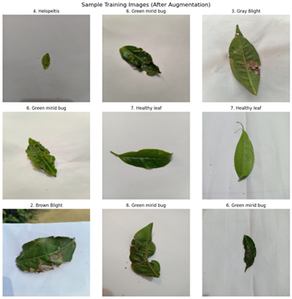
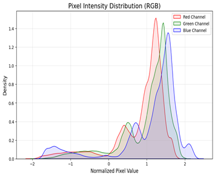
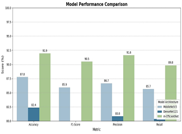
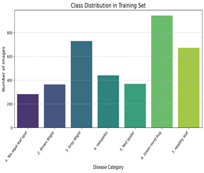
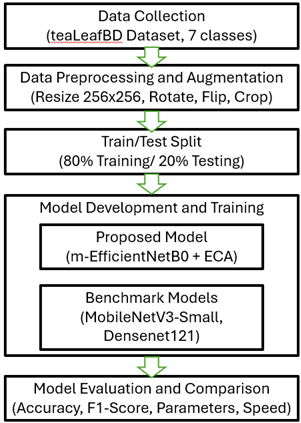

# m-EfficientNetB0+ECA: A Lightweight Model for Tea Leaf Disease Detection

This repository implements a lightweight, high-performance deep learning architecture designed for resource-constrained environments (e.g., mobile devices). By optimizing the EfficientNet-B0 backbone and integrating Efficient Channel Attention (ECA), this model provides an efficient solution for the automated diagnosis of tea leaf diseases.

## 🌿 Project Overview
Tea productivity is frequently threatened by various pathogens and pests. This project introduces **m-EfficientNetB0+ECA**, a redesigned network that minimizes computational overhead while maintaining high classification accuracy. 

**Key Innovations:**
* **Layer Streamlining:** Redundant layers from the original EfficientNet-B0 were removed to reduce parameter count.
* **ECA Integration:** Replaced standard Squeeze-and-Excitation (SE) blocks with **Efficient Channel Attention (ECA)** to capture cross-channel interactions without dimensionality reduction.

## 📊 Dataset: teaLeafBD
The model was trained and validated using the **teaLeafBD** dataset, which contains 5,276 high-resolution images categorized into 7 distinct classes.

  
   
  <em>Figure 1: Representative samples of tea leaf diseases from the dataset.</em>

### Class Distribution
The dataset distribution ensures the model is robust across common and rare disease manifestations.

  
   
  <em>Figure 2: Distribution of images across the 7 disease categories.</em>

## 🏗️ Methodology & Architecture
The proposed **m-EfficientNetB0+ECA** architecture focuses on maximizing the "Accuracy-to-Parameter" ratio. 

  
   
  <em>Figure 3: Detailed architecture of the proposed lightweight model featuring ECA modules.</em>

## 🚀 Training & Experimental Setup
The model was trained for 100 epochs using the following hyperparameters:
* **Optimizer:** Adam (Learning Rate: 0.001)
* **Scheduler:** ReduceLROnPlateau (Factor: 0.5, Patience: 15)
* **Augmentation:** Random Resized Crop, Horizontal/Vertical Flips, and Color Jitter.

  
   
  <em>Figure 4: Training and Validation Accuracy/Loss curves showing model convergence.</em>

## 📈 Performance Evaluation
The model's effectiveness was validated using a held-out test set (20% of total data). 

### Confusion Matrix
To analyze the model's ability to distinguish between visually similar diseases, a confusion matrix was generated:

  
   
  <em>Figure 5: Confusion matrix illustrating per-class prediction accuracy.</em>

### Final Metrics
The model achieves competitive results across all primary metrics:

  
   
  <em>Figure 6: Summary of Precision, Recall, and F1-Score for each class.</em>

## ⚙️ Setup and Installation
1. Clone the repository.
2. Install dependencies: `pip install torch torchvision matplotlib scikit-learn torchinfo`.
3. Open `final.ipynb` to train or evaluate the model.
